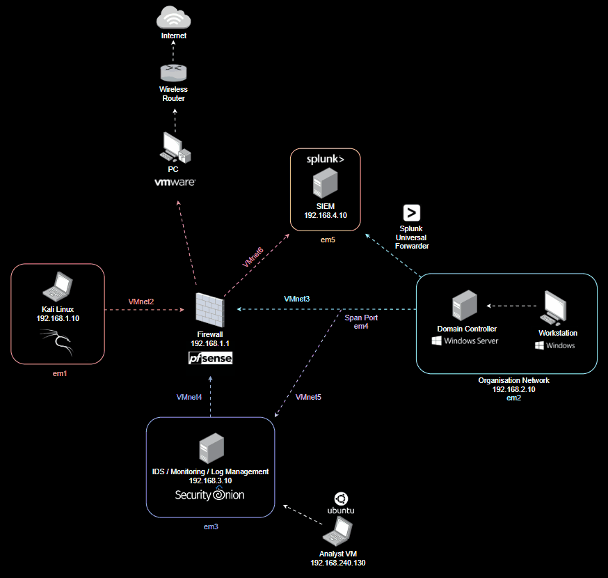

# Cyber Security Home Lab

Welcome to my fully built **Cyber Security Home Lab**, designed for **Purple Teaming** — the convergence of offensive (Red Team) and defensive (Blue Team) security practices. This self-contained lab allows for hands-on experimentation with attack simulations, detection engineering, and enterprise Windows infrastructure.

---

## Purpose

This lab was created to:

- Gain practical experience in **penetration testing** and **adversary simulation**
- Practice **Blue Team defense** with tools like **SIEM**, **IDS**, and **host telemetry**
- Understand **Active Directory**, **Group Policy**, and Windows-based enterprise architecture
- Develop, test, and tune **detection rules** and **incident response** processes
- Explore realistic **attack-defense scenarios** in a safe environment

---

## Lab Architecture

The lab is hosted locally using virtualization (e.g., VMware), segmented into isolated networks for attack, defense, and infrastructure.

---

## Tools & Technologies

### 🔴 Red Team

- **Kali Linux** – Offensive testing and enumeration

### 🔵 Blue Team

- **Splunk** – Log management and analysis
- **Security Onion** – IDS for network traffic inspection
- **Splunk Universal Forwarder** – Host-based telemetry

### 🏢 Infrastructure

- **Windows Server 2019**
  - Active Directory Domain Services (AD DS)
  - DNS, DHCP, Group Policy
- **Windows 10 Workstation**
  - Domain-joined for lateral movement and endpoint testing
- **GPO Hardening** – Password policies, LAPS, restricted groups
  
---

## Learning Outcomes

This lab helps me:

- Simulate and detect adversary behavior in real time
- Perform full-cycle incident response and alert tuning
- Develop and test custom detection logic (e.g., Sigma rules)
- Strengthen my knowledge of enterprise security operations
- Gain muscle memory for tools used in offensive and defensive teams

---

## 🔗 Inspiration

This project was inspired and guided by:

- [CyberWox Academy – Building a Cybersecurity Homelab](https://www.cyberwoxacademy.com/post/building-a-cybersecurity-homelab)
- [Tadi – Purple Team Home Lab Walkthrough (YouTube)](https://www.youtube.com/watch?v=8hvn5poOo0E)

---

## Disclaimer

> This homelab is for **educational and ethical use only**. All testing occurs in an isolated virtual environment. Never use these tools or techniques on networks you do not own or have explicit permission to test.

---

## Next Steps

- Integrate MITRE ATT&CK mapping for TTP tracking
- Extend topology with a Malware Analysis subnet
- Build automated alert pipelines (Sigma ➝ Wazuh/Splunk)
- Simulate real-world attack campaigns (e.g., ransomware, phishing)
- Extend to Azure or hybrid cloud environments

---

## Connect With Me

If you’ve built a similar lab, have tool recommendations, or just want to chat about cyber labs, feel free to connect or share ideas.

- [LinkedIn](https://www.linkedin.com/in/jp-cybersec/)

> _Built to break, detect, defend, and learn._

---
